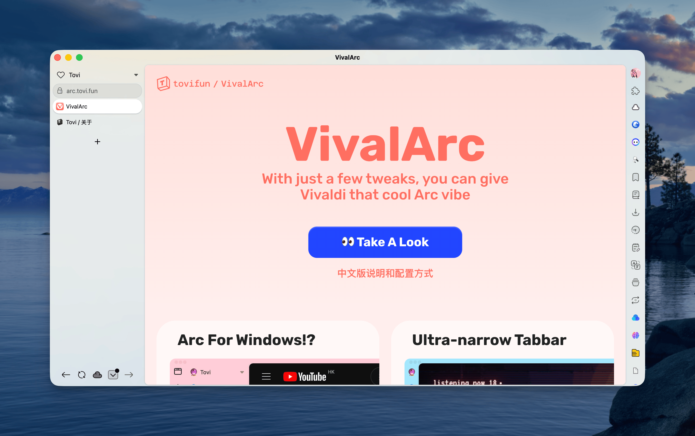

# VivalArc

将 Vivaldi 浏览器自定义配置成 Arc 浏览器的外观样式，作为 Arc 的完美平替。

**当前版本**: v1.3.0 | **支持 Vivaldi**: v7.9+ | **平台**: macOS, Windows, Linux

## 🚀 快速开始

### 1. 克隆项目
```bash
git clone https://github.com/tovifun/VivalArc.git
```

### 2. 选择版本

#### ✨ 根目录版本（唯一持续维护）
在 Vivaldi 设置中选择目录：`VivalArc/`

这是后续会继续接收修复和优化的唯一版本。

#### 📁 兼容性目录（历史保留）
- **自动隐藏标签栏**: `VivalArc/variants/autotab/`
- **紧凑布局**: `VivalArc/variants/compact/`

这些目录会继续保留，但后续不再作为主要迭代对象。

#### 📦 归档版本（旧版本支持）
- **Vivaldi 6.9**: `VivalArc/archive/v6.9/default/`
- **Vivaldi 7.0**: `VivalArc/archive/v7.0/default/`
- **Vivaldi 7.4**: `VivalArc/archive/v7.4/default/`

详细配置步骤请查看：[📝开始配置 VivalArc](./docs/installation/getting-started-cn.md)

## ✅ Vivaldi 7.8+ 推荐配置

从 Vivaldi 7.8 开始，浏览器已经加入了 Custom Tab Bar。就我自己现在的使用体验来说，最舒服的一套配置是：

- 标签栏顶部放 Address Bar
- Address Bar 下方放返回和前进按钮
- 右侧 Panel 里放 Extensions
- 顶部原生 Address Bar 隐藏

这套方式比起单纯依赖 CSS 去塞下所有控件，会更自然，也更适合长期使用。



## 📚 文档

### 快速入门
- [📝配置指南](./docs/installation/getting-started-cn.md)
- [📺视频教程 - 5分钟将 Vivaldi 配置成 Arc](https://www.bilibili.com/video/BV1fe4y1a7WQ)
- [📄项目背景故事](./docs/about/behind-the-scene-cn.md)

### 使用指南
- [📁历史变体说明](./docs/guides/variants-guide-cn.md)
- [🖼️推荐的 Vivaldi 主题](./docs/reference/curated-themes-cn.md)
- [🎨使用本地 Vivaldi 主题](./docs/guides/using-local-vivaldi-theme-cn.md)

### 参考资料
- [🧑‍💻常见问题 FAQ](./docs/reference/faq-cn.md)
- [🎉更新日志](./docs/reference/changelog-cn.md)
- [🌐VivalArc 官网](https://arc.tovi.fun)
- [📝English README](./README.md)

## 📂 项目结构

```
VivalArc/
├── vivalarc.css           # v7.9 默认版本
├── variants/              # 历史兼容目录
│   ├── autotab/          # 自动隐藏标签栏
│   └── compact/          # 紧凑布局
├── archive/              # 旧版本归档
│   ├── v6.9/
│   ├── v7.0/
│   └── v7.4/
├── themes/               # Vivaldi 主题包
├── assets/               # 资源文件
│   ├── icons/
│   └── wallpapers/
├── docs/                 # 完整文档
└── screenshots/          # 项目截图
``` 

## 🖥️ VivalArc Screenshot
 

---

## 💌 感谢
- Github [@clementpoiret](https://github.com/clementpoiret) 添加了 [ArcDark 主题](https://github.com/tovifun/VivalArc/pull/5)
- Bilibili @食用请在保质期 [提供的Windows上优化滚动条样式的方式](https://www.bilibili.com/video/BV1fe4y1a7WQ) 
- Github [@Zettry](https://github.com/Zettry) 解决了几个 [Issue](https://github.com/tovifun/VivalArc/issues/21)
---

## 🧑‍💻 来自用户的截屏
- Twitter [@altemo](https://x.com/atlemo/status/1765726601239491014)
- Twitter [@vivaldi_fr](https://twitter.com/vivaldi_fr/status/1684643796942815233)
- Github [@clementpoiret](https://github.com/tovifun/VivalArc/pull/5)
- Bilibili [@tovi(me)](https://www.bilibili.com/opus/844070281819455558)

---

## 🔗 相关链接

- **Arc评测：**[https://type.cyhsu.xyz/2022/08/arc/](https://type.cyhsu.xyz/2022/08/arc/)
- **Vivaldi官网**：[https://vivaldi.com](https://vivaldi.com/)
- **Vivaldi论坛，Modding Vivaldi：**[https://forum.vivaldi.net/topic/10549/modding-vivaldi](https://forum.vivaldi.net/topic/10549/modding-vivaldi)
