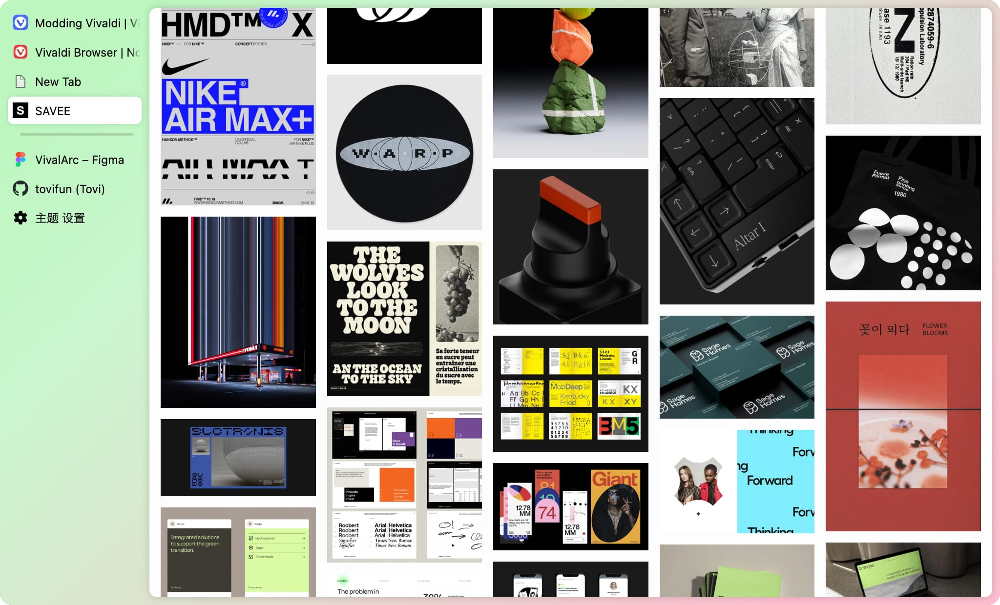

这个项目主要包含一个 CSS 文件和一个 Vivaldi 主题。通过几步简单的设置，可以将 Vivaldi 魔改成 Arc。

## 为什么做这个

大概说一下背景，我主力使用 Vivaldi 浏览器应该有一年，前段体验了还在内测中的 Arc 浏览器，差不多两个星期。这两个星期 Arc 的使用体验确实挺好的，交互很符合直觉，UI也非常的好看。

不过还是因为太想念 Vivaldi 丰富的功能，最后后换了回去（而且期间 Arc 崩溃了几次）。

后来了解到 Vivaldi 居然还有使用 CSS 自定义 UI 的功能，于是就尝试了一下，于是就有了这个页面所介绍的配置。

虽然比不上 Arc 的 UI 和细节，但是这套配置体验下来，我觉得能够大致还原 Arc 的使用体验。于是想将这套设置分享给大家，如果你还在等待 Arc 的测试，或者因为 Arc 过于占内存和过于[美貌](https://type.cyhsu.xyz/2022/08/arc/)，想试试别的选择，可以尝试使用下这套配置。

[设置方式_CN](doc_将Vivaldi配置成Arc.md.md) | [EN](doc_configure-vivaldi.md)
