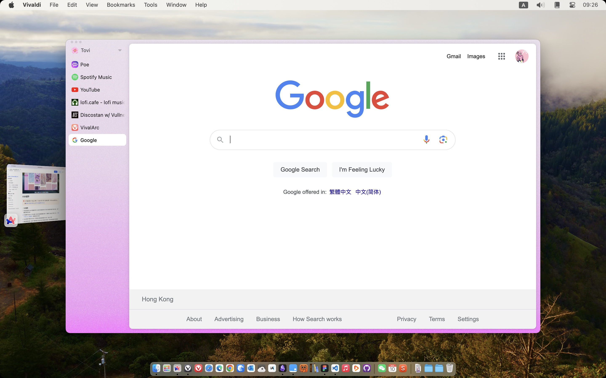

# VivalArc

Transform Vivaldi Browser into Arc Browser's elegant design - the perfect Arc alternative.

**Current Version**: v1.3.0 | **Supports Vivaldi**: v7.9+ | **Platforms**: macOS, Windows, Linux

## 🚀 Quick Start

### 1. Clone the Repository
```bash
git clone https://github.com/tovifun/VivalArc.git
```

### 2. Choose Your Version

#### ✨ Root Version (Actively Maintained)
In Vivaldi settings, select directory: `VivalArc/`

This is the only version that will continue to receive ongoing fixes and refinements.

#### 📁 Compatibility Folders (Legacy)
- **Auto-hide Tabbar**: `VivalArc/variants/autotab/`
- **Compact UI**: `VivalArc/variants/compact/`

These folders are kept for reference and compatibility, but they are no longer actively iterated.

#### 📦 Archived Versions (Legacy Support)
- **Vivaldi 6.9**: `VivalArc/archive/v6.9/default/`
- **Vivaldi 7.0**: `VivalArc/archive/v7.0/default/`
- **Vivaldi 7.4**: `VivalArc/archive/v7.4/default/`

For detailed configuration steps: [📝Getting Started Guide](./docs/installation/getting-started.md)

## 📚 Documentation

### Getting Started
- [📝Configuration Guide](./docs/installation/getting-started.md)
- [📁Legacy Variant Notes](./docs/guides/variants-guide.md)

### Guides
- [🖼️Recommended Vivaldi Themes](./docs/reference/curated-themes.md)
- [🎨Using Local Vivaldi Themes](./docs/guides/using-local-vivaldi-theme.md)

### Reference
- [🧑‍💻FAQ](./docs/reference/faq.md)
- [🎉Change Log](./docs/reference/changelog.md)
- [🌐VivalArc Website](https://arc.tovi.fun)
- [📝中文文档](./README-cn.md)

## 📂 Project Structure

```
VivalArc/
├── vivalarc.css           # v7.9 default version
├── variants/              # Legacy compatibility folders
│   ├── autotab/          # Auto-hide tabbar
│   └── compact/          # Compact UI
├── archive/              # Legacy versions
│   ├── v6.9/
│   ├── v7.0/
│   └── v7.4/
├── themes/               # Vivaldi theme packages
├── assets/               # Assets
│   ├── icons/
│   └── wallpapers/
├── docs/                 # Complete documentation
└── screenshots/          # Project screenshots
``` 

---
## 🖥️ VivalArc Screenshot
 

---

## 💌 Thanks for
- Github [@clementpoiret](https://github.com/clementpoiret) added [ArcDark Theme](https://github.com/tovifun/VivalArc/pull/5)
- Github [@Zettry](https://github.com/Zettry) Resolved multiple [Issues](https://github.com/tovifun/VivalArc/issues/21)

---

## 🧑‍💻 Beautiful Screenshots from：
- Twitter [@altemo](https://x.com/atlemo/status/1765726601239491014)
- Twitter [@vivaldi_fr](https://twitter.com/vivaldi_fr/status/1684643796942815233)
- Github [@clementpoiret](https://github.com/tovifun/VivalArc/pull/5)
- Bilibili [@tovi(me😉)](https://www.bilibili.com/opus/844070281819455558)
